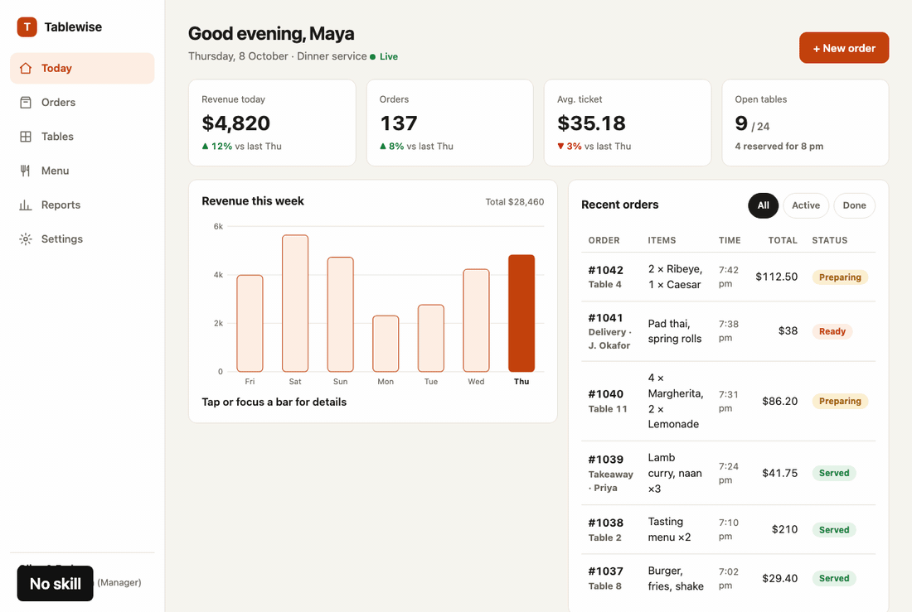
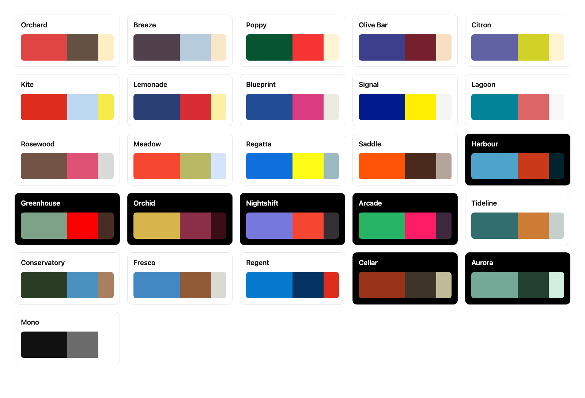
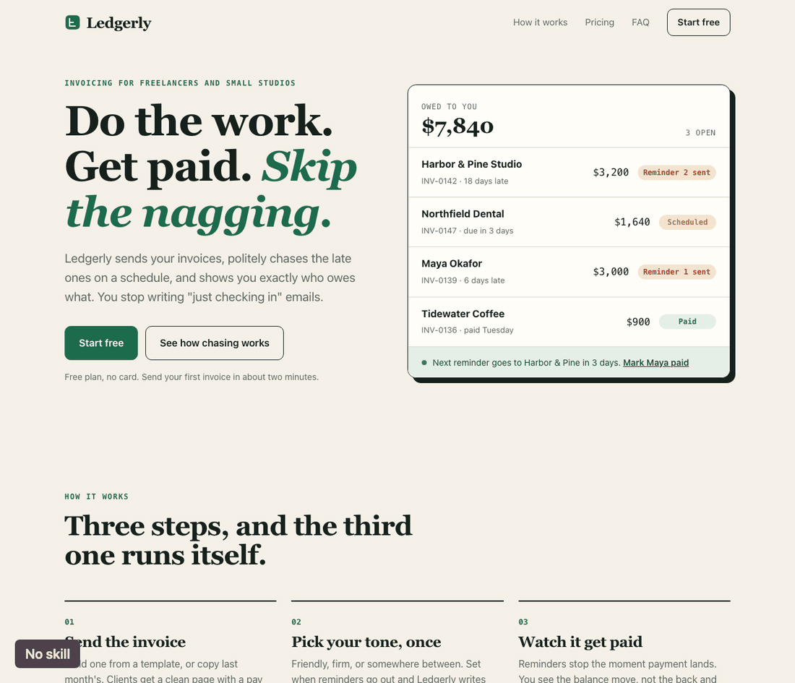
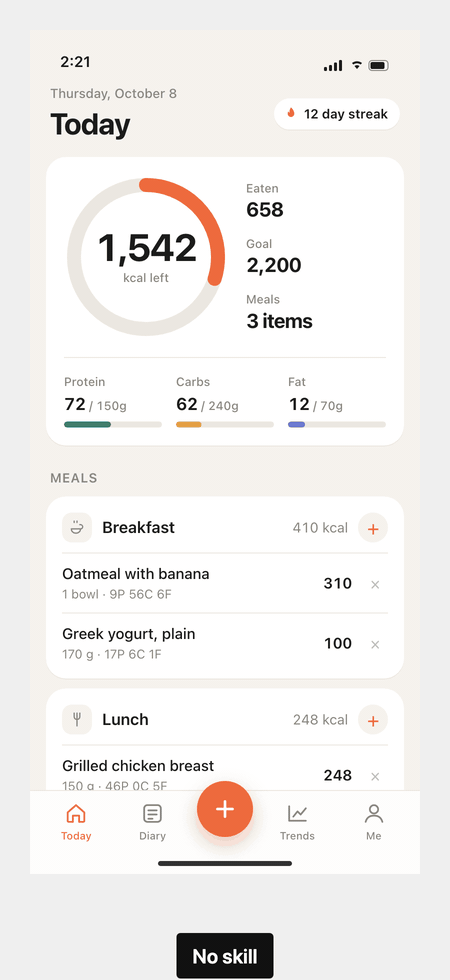

<p align="center">
  
</p>

<p align="center">
  <b>Your AI builds UIs that look like someone actually finished them.</b><br>
  A UI/UX skill for Claude Code, Codex and Cursor. Polished, plain, no AI slop.
</p>

<p align="center">
  <a href="LICENSE"></a>
  
  
</p>

---

Oxfords, not brogues. An Oxford is the plain shoe, and a brogue is the same shoe with a bunch of
decoration punched into it.

So this skill won't make your site look insane, and it won't give you crazy animations. There
are good skills for that already. What I wanted was the boring part done properly: a screen
that's clear, that's finished, and that doesn't have the stuff on it that tells everyone an AI
made it.

<p align="center">
  
</p>

<p align="center">
  
</p>

<p align="center"><sub>Same model, same one-paragraph brief. First with no skill, then with Oxfords.</sub></p>

## What you get

**The half that gets skipped.** AI builds the happy path and then stops. Oxfords makes it keep
going, so you get the button states, the feedback when you click something, the empty screen,
the error screen, what happens with a really long name or 10,000 rows, keyboard focus, and
tap targets that work on a phone.

**A screen you can actually scan.** Nobody reads a UI. You land on it with one question and
you hunt for the answer. So Oxfords lines things up on edges, lets the data decide what
component to use, and makes one thing on the screen important instead of all of it.

**No AI slop.** I kept seeing the same tells in everything AI builds, even with good design
skills loaded, so there's a strict list of them and what to use instead:

| Out | In |
|---|---|
| A coloured bar down the side of the active nav item | A full-row fill |
| A card around everything, cards inside cards | Space, alignment, one hairline |
| A small uppercase label above every heading | The heading |
| Inter, Geist, Poppins, Instrument Serif, Playfair | The system font, or a face you can give a reason for |
| Emoji as icons, the stock icon set at default stroke | One icon set, one weight, matched to the text |
| Bone and orange, white and blue, purple gradients | A palette chosen for the product, with a reason |
| Gradient text, glows | One accent, used for action and state |
| A tinted pill on every status | Colour only where something needs attention |
| Bounce, fade-up on everything, pulsing dots | Short ease-out transitions that explain a change |
| "Seamless", "Get started", Acme, 99.9% | The plain sentence and believable data |

**Colours somebody actually picked.** You've probably noticed Claude goes for the same bone
background with an orange accent on pretty much everything now. Before that it was purple
gradients, and if you tell it to be "clean" you get white, grey and one blue button. They're
all the same problem, the colour got picked by default. So Oxfords comes with 26 palettes,
three colours each, and the agent has to choose one for your product and say why. The
palette goes on top of proper neutrals though, white, black and greys still do most of the
work, so you don't end up with a page that's cream from edge to edge. On a phone it sits on
pure black or pure white, with the navigation in Liquid Glass.

<p align="center">
  
</p>

**A checker, so it's not just vibes.** One script, no dependencies:

```bash
node skills/oxfords/scripts/check.mjs ./src
```

```text
src/components/Sidebar.tsx
  FAIL  accent-rail          coloured bar on the side of an element; use a full fill or nothing  (line 42)
        border-left: 3px solid
  FAIL  default-font         default font nobody chose; use the system stack or a face with a stated reason  (line 7)
  WARN  viewport-100vh       100vh jumps on phones; use dvh or svh  (line 18)

1 file, 2 fail, 1 warn
```

It exits with an error when something fails, so you can put it in CI or a pre-commit hook.

## Install

**Claude Code, Codex and other agents that read skills**

```bash
npx skills add arhamhi/oxfords
```

Or copy `skills/oxfords` into your skills folder (`~/.claude/skills/` for Claude Code,
`~/.agents/skills/` for Codex and others).

**Cursor**

Copy `skills/oxfords` into your project and `adapters/cursor/oxfords.mdc` into
`.cursor/rules/`.

**Anything that reads AGENTS.md**

Copy `skills/oxfords` into your project and paste `adapters/AGENTS.md` into your `AGENTS.md`.

## Use

You don't have to do anything special. Ask for UI work the way you already do and the skill
loads when the task is a UI.

```text
Build the orders dashboard.
Review this settings page with oxfords.
This looks AI-generated. Fix it.
```

It works in three modes:

| Mode | What happens |
|---|---|
| Build | Works an eight-step build order from intent to finished states, then fills a done gate |
| Review | Looks first, runs the checker second, reports each finding as symptom, fix and reason |
| Fix | Changes only what a finding names and leaves your copy and identity alone |

## What is inside

```text
skills/oxfords/
  SKILL.md                       build order, done gate, slop floor, numbers
  references/
    app-ui.md                    dashboards, tables, charts, settings
    mobile.md                    app screens, navigation, sheets, gestures
    landing.md                   message, structure, what to leave out
    states-forms-copy.md         every state, forms, errors, copy, accessibility
    palettes.md                  neutrals, 26 palettes and how to apply them
    slop-floor.md                the full ban list with replacements
    motion.md                    timing, easing, gestures, reduced motion
    review.md                    the two-pass review and severity scale
  scripts/check.mjs              the slop checker
```

The main file is short on purpose. Your agent reads it every time, and only opens a reference
file for the thing it's actually building.

## What Oxfords is not

- **It won't replace your brand.** If your project already has colours or a design system,
  those win. The palettes are for when you've got nothing.
- **It won't give you a look.** If you want a landing page with a signature animation, use a
  design skill built for that and let Oxfords check the result after.
- **It can't see everything.** The checker reads text, so it can't tell if a label is clipped
  or if you've got a card inside a card. Those are on a short list you check by eye.

One thing I had to be careful with: plain doesn't mean empty. If you strip all the slop out
and add nothing, you get a grey page with one accent colour, and that's just a different kind
of generic. So Oxfords asks for real content, one clear thing to look at first, and choices
you can give a reason for.

## More examples

Same deal as the dashboard up top. Same model, same brief, first with no skill and then with
Oxfords.

**A startup landing page**

<p align="center">
  
</p>

The one without the skill looks fine at first, I'll be honest. But it's the bone background
again, with a little uppercase label over every section, numbered steps and an italic word in
the headline. You've seen that page a hundred times. The Oxfords one sits on white, shows the
actual product, and keeps the colour for two sections and the one button that matters.

**A calorie tracking app**

<p align="center">
  
</p>

Pure black, so it looks right on an OLED screen. The add button comes out of the middle of
the tab bar, the tab bar is glass with the list scrolling under it, and only the things that
matter get colour.

## How it was tested

I gave the same model the same one-paragraph brief for each example, once with no skill and
once with Oxfords. All six builds are in [`docs/builds`](docs/builds) and you can run the
checker on them yourself:

```text
dashboard-no-skill.html   1 fail, 3 warn
landing-no-skill.html     1 fail, 3 warn
mobile-no-skill.html      2 fail, 3 warn
the three Oxfords builds  0 fail, 1 warn between them
```

To be straight about it: the no-skill builds are first attempts, and the Oxfords ones aren't.
I rebuilt them a few times while I was fixing the skill, mostly the colour rules, and for
these three I told it which palette to use so the examples wouldn't all come out the same.
So take it as an example of what the skill is going for and not a benchmark. And the checker
only catches the mechanical stuff. Most of what's different in those GIFs is the part it
can't see.

<p align="center">
  
</p>

## Credits

I didn't come up with most of this. The usability side I learned from
[Kole Jain](https://www.youtube.com/@KoleJain)'s videos, and you should watch them. I also
studied [impeccable](https://github.com/pbakaus/impeccable) by Paul Bakaus,
[taste-skill](https://github.com/Leonxlnx/taste-skill) by Leonxlnx, and
[apple-design](https://github.com/emilkowalski/skills) by Emil Kowalski, and took ideas from
each. Everything here is written in my own words, and what came from where is in
[CREDITS.md](CREDITS.md).

The paintings in this repo were made in code, stroke by stroke. They're all in [`art`](art).

## Licence

MIT. See [LICENSE](LICENSE).
